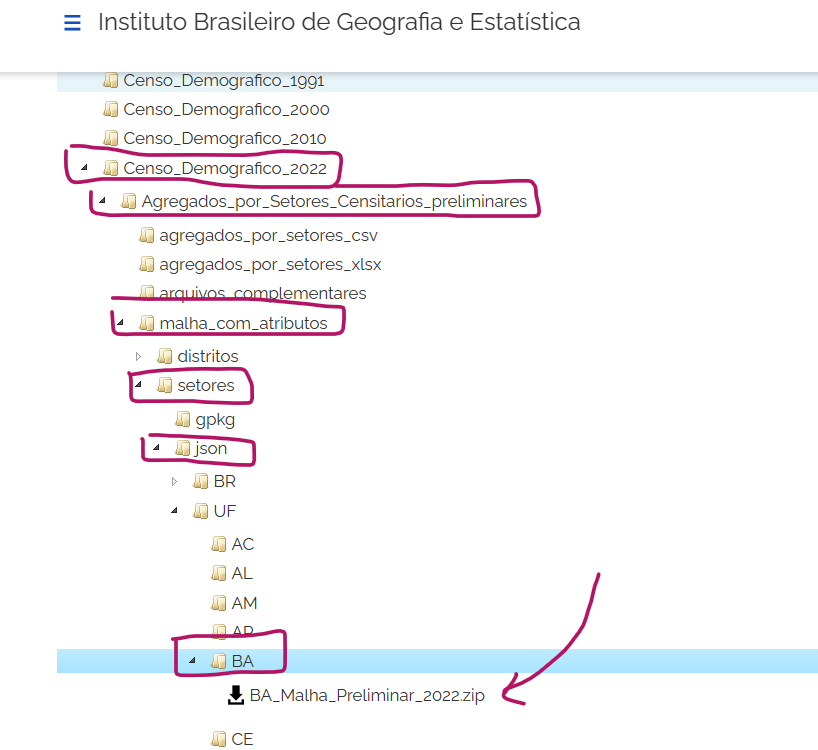

# Edital Avaliação 01

## A avaliação será baseada nos exercícios desenvolvidos em sala de aula

Os trabalhos podem ser feitos de forma individual, em duplas ou em trios. O nome dos alunos de cada grupo devem aparecer no início de cada programa como comentários.

Os códigos devem ser comentados, demonstrando o entendimento do programa.

1. Algoritmo da Escada:
    - Algoritmo que calcula o número de espelhos de uma escada
    - entrada: valor da distância entre os pavimentos da escada
    - saída: número de espelhos, altura dos espelhos e profundidade dos pisos
    - critério: a escada deve ter o menor número de espelhos, com altura máxima menor ou igual a 0.18m
    - Enviar também o fluxograma do algoritmo.

1. Algoritmo das cotas dos pavimentos - por altura máxima:
    - Algoritmo que calcula as cotas de nível de lajes equidistantes de um edifício
    - entradas: valor da cota inicial, valor da distância entre pavimentos, valor da altura máxima do edifício
    - saída: as cotas de todos os níveis
    - critério: calcular todas as cotas de nível de um edifício, tendo o primeiro nível como a cota inicial e as outras cotas para o maior número de pavimentos desde que não ultrapassem a cota da altura máxima informada
  

1. Algoritmo das cotas dos pavimentos - por número de pavimentos:
    - Algoritmo que calcula as cotas de nível de lajes equidistantes de um edifício
    - entradas: valor da cota inicial, valor da distância entre pavimentos, número de pavimentos do edifício
    - saída: as cotas de todos os níveis
    - critério: calcular todas as cotas de nível de um edifício, tendo o primeiro nível como a cota inicial e  as outras cotas para o maior número de pavimentos desde que não ultrapassem a cota da altura máxima informada 

1. Algoritmo da manha de pontos regulares:
    - Algoritmo que gera a imagem de uma malha de ponto regulares
    - entradas: distância entre pontos em x, distância entre os pontos em y, número de pontos em x, número de pontos em y
    - saída: imagem gerada com a biblioteca matplotlib da malha de pontos

1. Algoritmo da treliça:
    - Utilizar o matplotlib para desenhar uma treliça com banzo superior, inferior e diagonais 

1. Mapa de densidade demográfica por setores censitários:
    - No site do IBGE [https://www.ibge.gov.br/estatisticas/downloads-estatisticas.html](https://www.ibge.gov.br/estatisticas/downloads-estatisticas.html) baixe os dados do Censo demográfico de 2022, agregados por setores censitários preliminares, a malha com  atributos para o estado da Bahia. ver figura abaixo:
      
        
      
    - Utilizando a linguagem Python, carregue o arquivo baixado como um GeoDataFrame utilizando a biblioteca Geopandas.
     - gere uma imagem com o mapa
     - filtre os dados para a cidade de Salvador
     - gere um mapa com a imagem
     - Mude o CRS para EPSG:31984
     - crie uma variável coma densidade populacional dos setores censitários
     - utilizando o Google Earth, marque um ponto central de um terreno qualquer na cidade de Salvador.
     - Com as coordenadas deste ponto crie um GeoDataFrame com apenas este ponto.
     - coloque o ponto no mesmo CRS da malha de Salvador e gere uma imagem com o ponto e o mapa
     - Com o ponto como centro, filtre o GeoDataFrame de Salvador, selecionando os setores censitários que estão localizados em um raio de 1km a partir do ponto.
     - Gere uma imagem com o mapa e o ponto.
     - A imagem deve conter:
       - malha de Salvador (filtrada para o entorno do ponto) colorida conforme a densidade demográfica de cada setor.
       - legenda da densidade populacional com título
       - título da imagem
       - indique o ponto do terreno com um texto
       - Malha e textos com valores completos (sem utilizar notação científica)
       - um mapa de contexto da biblioteca contextily
      - salve a imagem.

## Os trabalhos devem ser enviados em arquivo zipado pelo Canvas da disciplina.
